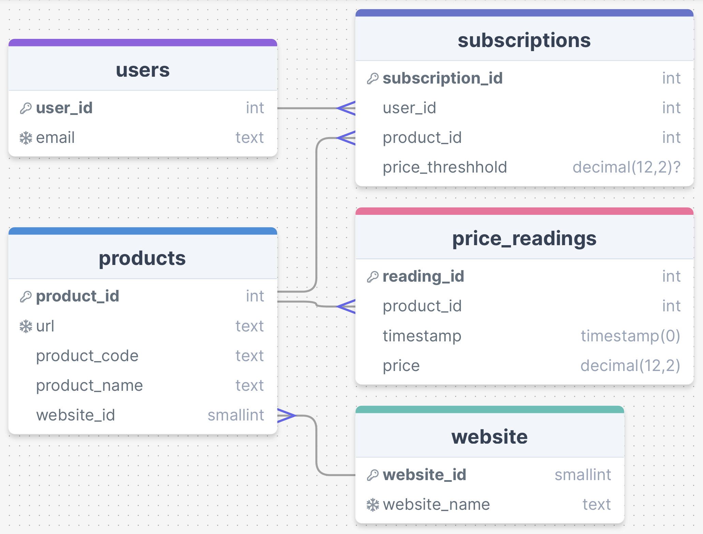
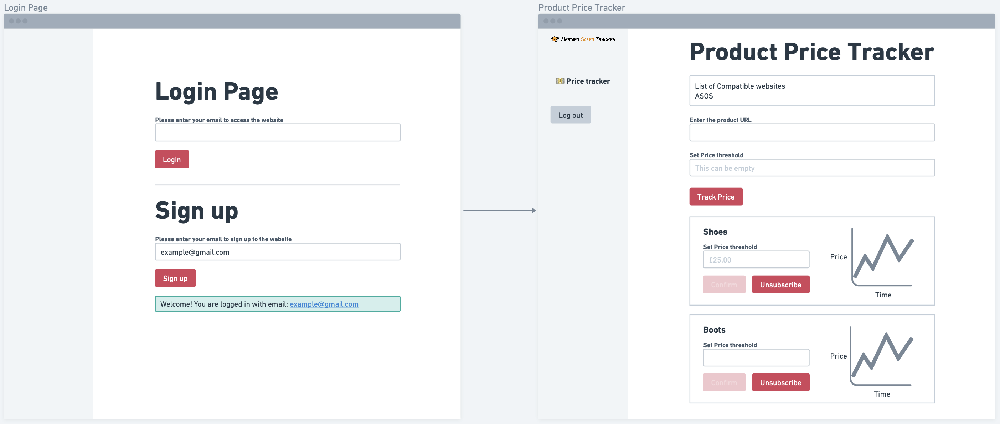

# Diagrams

This folder contains the diagrams explaining the functionality and construction of the infrastructure.

## Architecture Diagram

This shows the cloud infrastructure used and the links between them.

## ERD (Entity Relationship Diagram)

This shows the tables used within the database, displaying the columns within each and the relationship between them.

## Dashboard Wireframe

This shows the basic structure of the dashboard navigation.