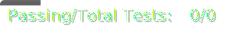

# 

[](./.util/pytest_scores.txt)
[](./.util/pylint_scores.txt)
[](./.util/pylint_scores.txt)

# Welcome to Hermes Sale Tracker Repository

This project is designed to track products and notify users when they go on sale. By entering the product URL and your email into the dashboard, you can receive notifications whenever the product's price decreases or falls below a specified threshold. Additionally, the dashboard lets you view the price history of tracked products, making sure you always get the best price.

## Folders

| Folder | Description |
|---|---|
| **.github** | GitHub-specific files and actions. |
| **.util** | Utility scripts and tools. |
| **Clean-up** | The scripts for cleaning up unsubscribed products from the database. |
| **Dashboard** | Code used for the dashboard and visualization. |
| **Database**  | Database management scripts and configurations. |
| **Diagrams** | Diagrams of the system architecture and entity relationship diagram. |
| **ETL**  | ETL pipeline scripts and configurations. |

## Setup

Follow these steps to set up the application:

### Dependencies

1. **Clone the repository**:
    ```bash
    git clone https://github.com/BerkayDur/sales-tracker-hermes
    ```

2. **Create and activate a virtual environment (optional but recommended)**:
    ```bash
    python3 -m venv .venv
    source .venv/bin/activate
    ```

3. **Install the dependencies**:
    ```bash
    pip3 install -r requirements.txt
    ```

## Cloud Architecture
The architecture of the project is shown in the following brief overview:


## Cloud Architecture Description

The Hermes Sale Tracker project uses cloud architecture designed for efficiency, scalability, and automation. Below is a detailed description of each component and its role in the system.

### Relational Database Service (RDS)

An Amazon RDS instance is used to store the tables as depicted in the Entity Relationship Diagram (ERD). These tables include:

- **users**: Contains contact information for registered users.
- **subscriptions**: Stores data on products each user is subscribed to, along with optional price thresholds.
- **products**: Contains data on each product being tracked.
- **price_readings**: Stores historical price readings for each product.

### ETL Pipeline

The Extract, Transform, Load (ETL) pipeline is designed for updating product price data regularly and allowing for extensive upscaling without compromising performance.

- **Extract**: 
  - **Provisioning Lambda**: This Lambda function extracts data from the RDS and groups data together into manageable chunks each to be processed by separate transform lambdas. This ensures that irrespective of the number of products being tracked, the lambdas are able to scrape the price data efficiently.
- **Transform**:
  - **Transform**: Within these Lambdas the data is then processed and filtered to only send forward details of products that have decreased in price to the load process.
- **Load**:
  - **Email Lambda**: This script uses Amazon Simple Email Service (SES) to send alerts to users when there are price reductions.

### Streamlit Dashboard

The Streamlit dashboard provides a user interface for managing and tracking product subscriptions. It runs on an Amazon ECS (Elastic Container Service) and offers the following functionalities:

- **Price History Visualization**: Displays the historical price data for tracked products, helping users make informed purchasing decisions.
- **Initial Data Scrape**: Allows users to add new products by providing URLs and initial product data.

### Cleanup Script

A cleanup script runs daily to remove the RDS entries that no longer have any users subscribed to them, reducing redundancy.

### Infrastructure as Code (IaC) with Terraform

Each component of the architecture is provisioned and managed using Terraform scripts, ensuring consistency, scalability.
Continuous Integration and Continuous Deployment (CI/CD) practices are followed, allowing for seamless deployment and updates.

## Key Technologies Chosen

### Amazon Web Services (AWS)

AWS was chosen for this project because it is the most widely used cloud platform and offers a wide range of tools and services that allow for scalability, and ease of use.

- **AWS Lambda**: Serverless compute service that runs code in response to events. Lambda functions are used in the ETL pipeline for data extraction, transformation, and loading processes, ensuring efficient and scalable data handling.

- **Amazon RDS (Relational Database Service)**: Managed relational database service that provides scalable and reliable database solutions. RDS is used to store the core data for the application, including user information, subscriptions, product details, and price readings.

- **Amazon ECS (Elastic Container Service)**: Highly scalable container orchestration service. ECS is used to run the Streamlit dashboard, allowing for containerized application management and deployment.

- **Amazon ECR (Elastic Container Registry)**: Managed Docker container registry that makes it easy to store, manage, and deploy Docker container images. ECR is used to store the Docker images for the Streamlit dashboard and each of the lambdas.

- **Amazon SES (Simple Email Service)**: Scalable and cost-effective email service. SES is used to send email notifications to users when product prices drop below specified thresholds, ensuring timely alerts.

- **Amazon EventBridge**: Serverless event bus that makes it easy to launch applications using a schedule. EventBridge is used to trigger the cleanup script and the price checking ETL pipeline.

### Streamlit

- **Streamlit**: Streamlit is used to build the user-facing dashboard, providing an interactive interface for users to manage product subscriptions, view price history, and add new products.

### Terraform

- **Terraform**: An open-source infrastructure as code (IaC) software tool. Terraform is used to define and provision the infrastructure for the project, ensuring consistent and reproducible deployment of AWS resources. It allows for automated setup and management of the entire cloud environment.

## Entity Relationship Diagram
The database structure can be seen in the following diagram:


| Table | Description |
|---|---|
| users | Containing the contact information for each registered user |
| subscriptions | Containing products that each user is subscribed to as well as the optional price threshold that the user entered for each product |
| products | Containing the data for each product that is being tracked |
| price_readings | Containing the readings for the the prices for each product over time |


## Authors

| Name | Github Profile |
|---|---|
| **Faris Abulula** | **[A-Faris](https://github.com/A-Faris)**|
| **Berkay Dur** | **[BerkayDur](https://github.com/BerkayDur)**|
| **Daniel Hudson** | **[danfh00](https://github.com/danfh00)** |
| **Nabiha Mohamed** | **[NabihaMoh](https://github.com/NabihaMoh)** |


We hope you find this project useful for tracking and managing product sales. 
Happy tracking!