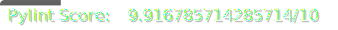

# 

[](./.util/pytest_scores.json)
[](./.util/pylint_scores.json)

# Welcome to Hermes Sale Tracker Repository

This project is designed to track products and notify users when they go on sale. By entering the product URL and your email into the dashboard, you can receive notifications whenever the product's price decreases or falls below a specified threshold. Additionally, the dashboard lets you view the price history of tracked products, making sure you always get the best price.


## Folders

| Folder | Description |
|---|---|
| **.github** | GitHub-specific files and actions. |
| **.util** | Utility scripts and tools. |
| **Clean-up** | The scripts for cleaning up unsubscribed products from the database. |
| **Dashboard** | Code used for the dashboard and visualization. |
| **Database**  | Database management scripts and configurations. |
| **Diagrams** | Diagrams of the system architecture and entity relationship diagram. |
| **ETL**  | ETL pipeline scripts and configurations. |


## Setup

Follow these steps to set up the project:


### Dependencies

1. **Clone the repository**:
    ```bash
    git clone https://github.com/BerkayDur/sales-tracker-hermes
    ```

2. **Create and activate a virtual environment (optional but recommended)**:
    ```bash
    python3 -m venv .venv
    source .venv/bin/activate
    ```

3. **Install the dependencies**:
    ```bash
    pip3 install -r requirements.txt
    ```


## Cloud Architecture
The architecture of the project is shown in the following brief overview:


## Entity Relationship Diagram
The database structure can be seen in the following diagram:


| Table | Description |
|---|---|
| users | Containing the contact information for each registered user |
| subscriptions | Containing products that each user is subscribed to as well as the optional price threshold that the user entered for each product |
| products | Containing the data for each product that is being tracked |
| price_readings | Containing the readings for the the prices for each product over time |


## Authors

| Name | Github Profile |
|---|---|
| **Faris Abulula** | **[A-Faris](https://github.com/A-Faris)**|
| **Berkay Dur** | **[BerkayDur](https://github.com/BerkayDur)**|
| **Daniel Hudson** | **[danfh00](https://github.com/danfh00)** |
| **Nabiha Mohamed** | **[NabihaMoh](https://github.com/NabihaMoh)** |


